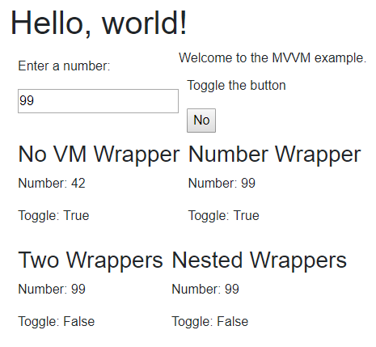

# Blazor Model View ViewModel (MVVM)

This is an example of a possible solution to support the MVVM pattern (more specifically, `INotifyPropertyChanged`).

Read the related blog post: [MVVM Support in Blazor](https://blog.jeremylikness.com/blog/2019-01-04_mvvm-support-in-blazor/).

Current Blazor version for this project is: `3.2.0-preview1.20073.1`

1. Navigate to the parent folder you would like to put the project in.
2. `git clone https://github.com/JeremyLikness/BlazorMVVM.git`
3. Open the `BlazorMVVM.sln` in Visual Studio 2017 or later
4. Compile/launch

[@JeremyLikness](https://twitter.com/JeremyLikness)